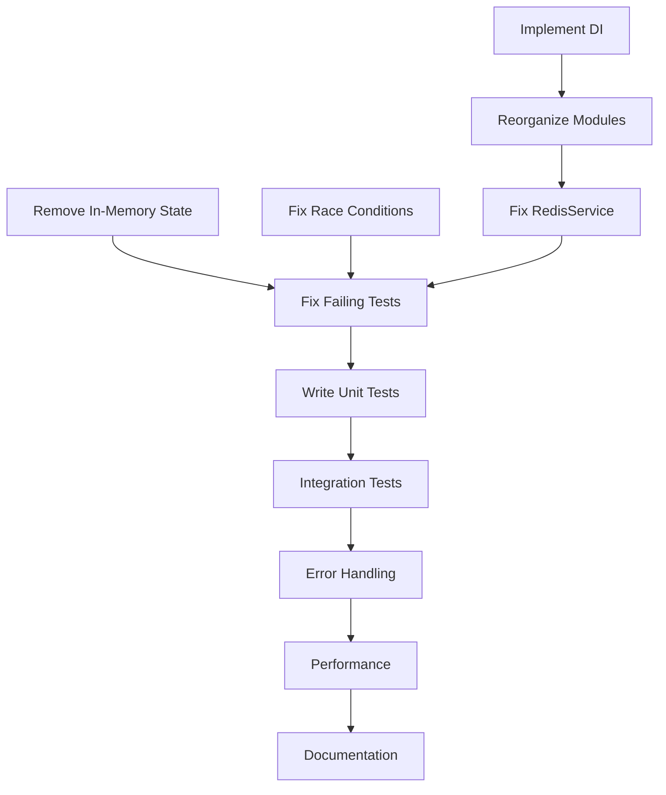

# 🎯 Architecture Improvement Task Plan

## Priority Levels
- 🔴 **P0**: Critical (Blocks Production)
- 🟡 **P1**: High (Major Issues)
- 🟢 **P2**: Medium (Improvements)
- 🔵 **P3**: Low (Nice to have)

---

## 📋 Task Breakdown

### Phase 1: Critical Fixes (Sprint 1)
**Goal**: Fix breaking issues that prevent the system from working

#### 🔴 Task 1: Remove All In-Memory State
**Priority**: P0  
**Estimated**: 4 hours  
**Subtasks**:
- [ ] 1.1 Replace `Map<string, Date>` in ModerationService with Redis
- [ ] 1.2 Replace `Map<string, UserViolation>` with Redis persistence
- [ ] 1.3 Move viewer tracking from memory to Redis sets
- [ ] 1.4 Move lane assignment cache to Redis
- [ ] 1.5 Create Redis key expiration strategies
- [ ] 1.6 Test distributed state management

**Acceptance Criteria**:
- No in-memory collections in any service
- All state persisted to Redis
- Service restart doesn't lose data
- Works with multiple instances

---

#### 🔴 Task 2: Fix Race Conditions
**Priority**: P0  
**Estimated**: 2 hours  
**Subtasks**:
- [ ] 2.1 Remove all `setTimeout()` calls
- [ ] 2.2 Use proper NestJS lifecycle hooks (`onModuleInit`)
- [ ] 2.3 Implement proper async initialization
- [ ] 2.4 Add connection retry logic with exponential backoff
- [ ] 2.5 Implement health checks for dependencies

**Code Changes**:
```typescript
// ❌ REMOVE THIS
setTimeout(() => this.loadBlockedUsers(), 100);

// ✅ REPLACE WITH
async onModuleInit() {
  await this.initializeService();
}
```

---

#### 🔴 Task 3: Implement Dependency Inversion
**Priority**: P0  
**Estimated**: 6 hours  
**Subtasks**:
- [ ] 3.1 Create repository interfaces in domain layer
  - [ ] `IUserRepository`
  - [ ] `IStreamRepository`
  - [ ] `ICommentRepository`
  - [ ] `ICacheRepository`
  - [ ] `IEventRepository`
- [ ] 3.2 Implement interfaces in infrastructure layer
- [ ] 3.3 Use dependency injection tokens
- [ ] 3.4 Update all services to use interfaces
- [ ] 3.5 Configure providers in modules

**File Structure**:
```
domain/repositories/
├── user.repository.interface.ts
├── stream.repository.interface.ts
├── comment.repository.interface.ts
└── cache.repository.interface.ts

infrastructure/repositories/
├── typeorm-user.repository.ts
├── typeorm-stream.repository.ts
├── typeorm-comment.repository.ts
└── redis-cache.repository.ts
```

---

### Phase 2: Architecture Cleanup (Sprint 1-2)
**Goal**: Organize code according to clean architecture principles

#### 🟡 Task 4: Reorganize Module Structure
**Priority**: P1  
**Estimated**: 4 hours  
**Subtasks**:
- [ ] 4.1 Move `/auth` contents to appropriate layers
  - [ ] Auth entities → `/domain/entities`
  - [ ] Auth services → `/application/services`
  - [ ] Auth controllers → `/presentation/controllers`
- [ ] 4.2 Move `/stream` contents to layers
- [ ] 4.3 Move `/comment` contents to layers
- [ ] 4.4 Move `/moderation` contents to layers
- [ ] 4.5 Move `/analytics` contents to layers
- [ ] 4.6 Delete empty directories
- [ ] 4.7 Update all import paths
- [ ] 4.8 Update module definitions

**Target Structure**:
```
src/
├── domain/           # Pure business logic
├── application/      # Use cases
├── infrastructure/   # External services
└── presentation/     # API layer
```

---

#### 🟡 Task 5: Fix RedisService
**Priority**: P1  
**Estimated**: 3 hours  
**Subtasks**:
- [ ] 5.1 Remove all business logic from RedisService
- [ ] 5.2 Create domain services for:
  - [ ] CommentCacheService
  - [ ] ViewerTrackingService
  - [ ] StreamCacheService
- [ ] 5.3 Move business logic to appropriate services
- [ ] 5.4 Make RedisService a pure infrastructure adapter
- [ ] 5.5 Add proper error handling

---

### Phase 3: Test Coverage (Sprint 2)
**Goal**: Achieve 65% test coverage

#### 🟡 Task 6: Fix Failing Tests
**Priority**: P1  
**Estimated**: 4 hours  
**Subtasks**:
- [ ] 6.1 Fix auth.service.spec.ts (avatarUrl issue)
- [ ] 6.2 Fix stream-domain.service.spec.ts (categorization)
- [ ] 6.3 Fix analytics-domain.service.spec.ts (NaN issues)
- [ ] 6.4 Fix redis.service.spec.ts (missing methods)
- [ ] 6.5 Fix stream-settings.vo.spec.ts (type error)

---

#### 🟡 Task 7: Write Missing Unit Tests
**Priority**: P1  
**Estimated**: 8 hours  
**Subtasks**:
- [ ] 7.1 Domain layer tests (target: 80% coverage)
  - [ ] All entities
  - [ ] All value objects
  - [ ] All domain services
- [ ] 7.2 Application layer tests (target: 70% coverage)
  - [ ] All application services
  - [ ] All DTOs and mappers
- [ ] 7.3 Infrastructure layer tests (target: 60% coverage)
  - [ ] Repository implementations
  - [ ] External service adapters
- [ ] 7.4 Presentation layer tests (target: 50% coverage)
  - [ ] Controllers
  - [ ] WebSocket gateways
  - [ ] Guards and interceptors

**Coverage Targets**:
```
Current: 25% → Target: 65%
- Domain: 80%
- Application: 70%
- Infrastructure: 60%
- Presentation: 50%
```

---

#### 🟢 Task 8: Create Integration Tests
**Priority**: P2  
**Estimated**: 6 hours  
**Subtasks**:
- [ ] 8.1 Database integration tests
- [ ] 8.2 Redis integration tests
- [ ] 8.3 WebSocket integration tests
- [ ] 8.4 End-to-end API tests
- [ ] 8.5 Authentication flow tests

---

### Phase 4: Production Readiness (Sprint 3)
**Goal**: Make the system production-ready

#### 🟢 Task 9: Add Error Handling & Monitoring
**Priority**: P2  
**Estimated**: 4 hours  
**Subtasks**:
- [ ] 9.1 Implement global exception filter
- [ ] 9.2 Add structured logging (Winston/Pino)
- [ ] 9.3 Add request/response logging
- [ ] 9.4 Implement circuit breakers
- [ ] 9.5 Add metrics collection (Prometheus)
- [ ] 9.6 Create health check endpoints

---

#### 🟢 Task 10: Performance Optimization
**Priority**: P2  
**Estimated**: 4 hours  
**Subtasks**:
- [ ] 10.1 Add database query optimization
- [ ] 10.2 Implement Redis caching strategies
- [ ] 10.3 Add connection pooling
- [ ] 10.4 Optimize WebSocket message handling
- [ ] 10.5 Add rate limiting

---

#### 🔵 Task 11: Documentation
**Priority**: P3  
**Estimated**: 3 hours  
**Subtasks**:
- [ ] 11.1 API documentation (OpenAPI/Swagger)
- [ ] 11.2 Architecture documentation
- [ ] 11.3 Deployment guide
- [ ] 11.4 Developer onboarding guide
- [ ] 11.5 Architecture Decision Records (ADRs)

---

## 📊 Task Dependencies



---

## 🚀 Execution Plan

### Week 1 (Critical Fixes)
- **Monday-Tuesday**: Tasks 1-2 (Remove state, fix race conditions)
- **Wednesday-Thursday**: Task 3 (Dependency inversion)
- **Friday**: Task 6 (Fix failing tests)

### Week 2 (Architecture & Testing)
- **Monday-Tuesday**: Task 4-5 (Reorganize modules, fix Redis)
- **Wednesday-Friday**: Task 7 (Write unit tests)

### Week 3 (Production Ready)
- **Monday**: Task 8 (Integration tests)
- **Tuesday-Wednesday**: Task 9 (Error handling)
- **Thursday**: Task 10 (Performance)
- **Friday**: Task 11 (Documentation)

---

## ✅ Success Metrics

### Technical Metrics
- [ ] 0 failing tests
- [ ] 65%+ test coverage
- [ ] 0 in-memory state
- [ ] 0 setTimeout calls
- [ ] 100% interfaces for dependencies

### Architecture Metrics
- [ ] Clear layer separation
- [ ] No circular dependencies
- [ ] All SOLID principles followed
- [ ] Domain layer has 0 external dependencies

### Production Metrics
- [ ] <100ms p95 API response time
- [ ] Support for 10k concurrent WebSocket connections
- [ ] Zero-downtime deployments
- [ ] Horizontal scaling capability

---

## 🎯 Definition of Done

Each task is considered complete when:
1. ✅ Code implemented and reviewed
2. ✅ Unit tests written and passing
3. ✅ Integration tests passing
4. ✅ Documentation updated
5. ✅ No lint errors
6. ✅ No TypeScript errors
7. ✅ Code coverage target met

---

## 🔥 Risk Mitigation

### High Risk Items
1. **Data Migration**: Moving from in-memory to Redis
   - Mitigation: Implement dual-write during transition
   
2. **Breaking Changes**: Module reorganization
   - Mitigation: Use git branches, incremental changes
   
3. **Performance Impact**: Redis for everything
   - Mitigation: Implement caching layers, optimize queries

---

## 📈 Progress Tracking

Use this checklist to track progress:

**Phase 1**: ⬜⬜⬜ (0/3 tasks)  
**Phase 2**: ⬜⬜⬜ (0/3 tasks)  
**Phase 3**: ⬜⬜⬜ (0/3 tasks)  
**Phase 4**: ⬜⬜⬜ (0/3 tasks)  

**Overall**: 0/12 tasks (0%)

---

*Last Updated: 2024-01-07*  
*Estimated Total Effort: 60 hours*  
*Team Size Recommendation: 2-3 developers*